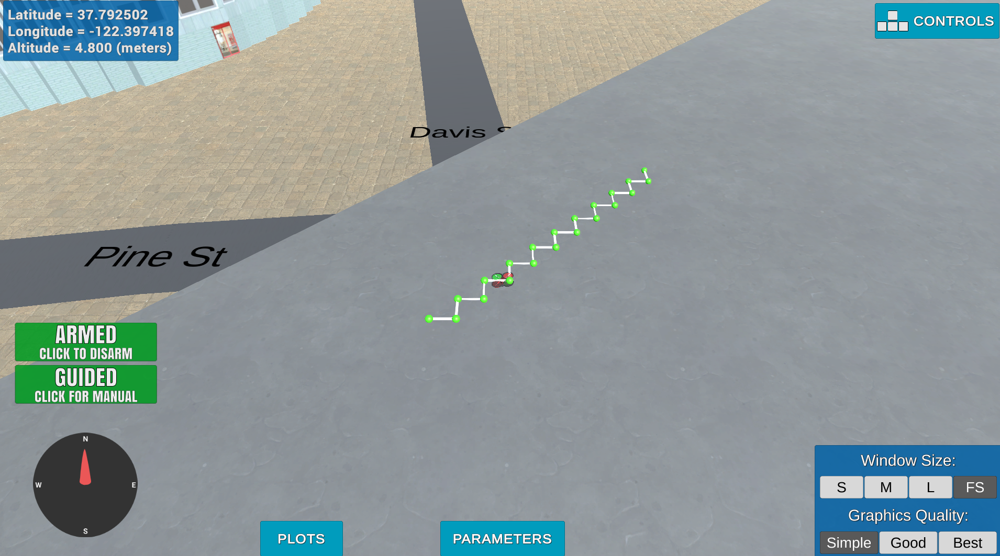

## Project: 3D Motion Planning


---


# Required Steps for a Passing Submission:
1. Load the 2.5D map in the colliders.csv file describing the environment.
2. Discretize the environment into a grid or graph representation.
3. Define the start and goal locations.
4. Perform a search using A* or other search algorithm.
5. Use a collinearity test or ray tracing method (like Bresenham) to remove unnecessary waypoints.
6. Return waypoints in local ECEF coordinates (format for `self.all_waypoints` is [N, E, altitude, heading], where the drone’s start location corresponds to [0, 0, 0, 0].
7. Write it up.
8. Congratulations!  Your Done!

## [Rubric](https://review.udacity.com/#!/rubrics/1534/view) Points
### Here I will consider the rubric points individually and describe how I addressed each point in my implementation.  

---
### Writeup / README

#### 1. Provide a Writeup / README that includes all the rubric points and how you addressed each one.  You can submit your writeup as markdown or pdf.  

You're reading it! Below I describe how I addressed each rubric point and where in my code each point is handled.

### Explain the Starter Code

#### 1. Explain the functionality of what's provided in `motion_planning.py` and `planning_utils.py`
These scripts contain a basic planning implementation. In the `planning_utils.py`, the following are implemented. 
* create_grid function: Creates a 2D grid configuration space given obstacle data 
* Action class: Defines the possible actions that are available to the drone
* a_start: creates a fisible path from an initial point to a final point given a 2D grid configuration 
* heuristic: function used by the a_star algorithm as a cost function.

With respect to the `motion_planning.py`, this scripts contains a state machine that takes the drone into multple state, each of whic implements a specific function. The states that are included are the following: 
* MANUAL: This is the intial state of the robot when it is turned on
* ARMING: This state indicates that the robot is ready to be controlled
* TAKEOFF: During this state the robot flies to specific altitude from it current position
* WAYPOINT: This state, when activated receives waypoint computed from the PLANNING state and sends it to the robot
* LANDING: This state lands the drone 
* DISARMING: This disarms the drone
* PLANNING : This is the state that when reached implements the path planning algorithm that would be explained in more details below

The current simple implementation, when the state enters into planning mode, computes the path that takes the robot from its current position to 10 meters in other the east and north direction forward. It does this with the a_star algorithm and the 2d grid configuration map created by the create grid function. See below an images of the path planned. It shows the path the robot follows. 

### Implementing Your Path Planning Algorithm

#### 1. Set your global home position
Here students should read the first line of the csv file, extract lat0 and lon0 as floating point values and use the self.set_home_position() method to set global home. Explain briefly how you accomplished this in your code.

To accomplish this goal, I wrote a function called "obtain_lat0_lon0" in line 134 of the motion planning code, that takes the first row of the collider.csv file, splits its into two using the split function from python based on where there is a comma ",". Then for each of the splitted string, perform the same split but now with a space delimeter" ". After this convert the string value to float and then return the result. 

In order to set this position as the global home position, I used the "self.set_home_psotion(lon, lat,0)".

#### 2. Set your current local position
Here as long as you successfully determine your local position relative to global home you'll be all set. Explain briefly how you accomplished this in your code.

In order to dertermine your local position wrt your home, there are two options depending on the situation you find yourself. If the goal is to find your current local position, then after setting home as mentioned previosly, you can get this value by calling the "self.local_position". 

In the case whereby the position is not your current position or you have not set a home position, then the way to do it is by using the "global_to_local(global_position, global_home)" function. In this case, global_position is the position you want to find in your local frame. 
#### 3. Set grid start position from local position
This is another step in adding flexibility to the start location. As long as it works you're good to go!

In order to this, first we need to get grid north and east offsets. This is done by calling the funtion create_grid. With this value and out current local_position which we can get with the variable "self.local_position" as explained in the previous section, performing the following calculation, should gives out local position position in the grid map which we can then use as the starting position for the path planning. 
```
start_position = (int(-north_offset+self.local_position[0]), int(-east_offset+self.local_position[1]))
```

#### 4. Set grid goal position from geodetic coords
This step is to add flexibility to the desired goal location. Should be able to choose any (lat, lon) within the map and have it rendered to a goal location on the grid.

Similary as we mentioned in section 2, we can find the local position of the robot with the "global_to_local(goal_position, global_home)" function. With this, using the same steps as in the previous section, we can find that position in the planning 2D grid. 
```
goal_ll_np = np.array([goal_ll[1], goal_ll[0], 0])
        goal_local_position = global_to_local(goal_ll_np, self.global_home)
        # include map offset
        grid_goal = (int(-north_offset+goal_local_position[0]), int(-east_offset+goal_local_position[1]))
      
```


#### 5. Modify A* to include diagonal motion (or replace A* altogether)
Minimal requirement here is to modify the code in planning_utils() to update the A* implementation to include diagonal motions on the grid that have a cost of sqrt(2), but more creative solutions are welcome. Explain the code you used to accomplish this step.

In the planning_utils.py script, in order to include digonal motions, first I modified the class "ACTION" and include four more actions, where the cost of each action is sqrt(2).
```
NORTH_EAST = (1,1,np.sqrt(2))
SOUTH_EAST =(-1,1,np.sqrt(2))
SOUTH_WEST = (-1,-1,np.sqrt(2))
NORTH_WEST = (1,-1,np.sqrt(2))
```
In addition, a modification was made to the valid_actions function to include the new added actions. Similary to the normal actions, if any movement leads the robot outside of the grid, then it is considered not valid. 
```
valid_actions.remove(Action.NORTH_EAST)
if  x +1 > n or grid[x+1, y+1] == 1:
valid_actions.remove(Action.SOUTH_EAST)
if  x +1 > n or grid[x+1, y-1] == 1:
valid_actions.remove(Action.SOUTH_WEST)
if  x-1 < 0 or grid[x-1, y-1] == 1:
valid_actions.remove(Action.NORTH_WEST)
```

#### 6. Cull waypoints 
For this step you can use a collinearity test or ray tracing method like Bresenham. The idea is simply to prune your path of unnecessary waypoints. Explain the code you used to accomplish this step.

In the plannig_utils scripts, I added a new funtion called "prune_paths" that uses the collinearity test to see whether three points form part of a line. 
```
def prune_path(path):
    pruned_path = [p for p in path]
    # TODO: prune the path!
    
    i = 0
    while i < len(pruned_path) - 2:
        p1 = point(pruned_path[i])
        p2 = point(pruned_path[i+1])
        p3 = point(pruned_path[i+2])
        
        # If the 3 points are in a line remove
        # the 2nd point.
        # The 3rd point now becomes and 2nd point
        # and the check is redone with a new third point
        # on the next iteration.
        if collinearity_check(p1, p2, p3):
            # Something subtle here but we can mutate
            # `pruned_path` freely because the length
            # of the list is check on every iteration.
            pruned_path.remove(pruned_path[i+1])
        else:
            i += 1
    return pruned_path
```
### Execute the flight
#### 1. Does it work?
In order to test the motion_planning.py implementation, open two terminals.
1. On the first terminal, run the motion planning environment as follows: 
```
./FCND-Sim_Linux_64-bit
```
You can get the latest simulation environment release from https://github.com/udacity/FCND-Simulator-Releases/releases.

2. On the second terminal, activate the conda environment and run the motion_planning script. You can choose a new gps goal by adding the "gps_goal_lat" and the "gps_goal_lon" when executing the python script in the commandline. If not added a default lattitude and longitude is used. 
```
conda activate fcnd
python3 motion_planning.py --gps_goal_lat xxxx --gps_goal_lon xxxx
```

### Double check that you've met specifications for each of the [rubric](https://review.udacity.com/#!/rubrics/1534/view) points.
  
# Extra Challenges: Real World Planning

For an extra challenge, consider implementing some of the techniques described in the "Real World Planning" lesson. You could try implementing a vehicle model to take dynamic constraints into account, or implement a replanning method to invoke if you get off course or encounter unexpected obstacles.

The following extra functionality were added to the code. 
### Add heading commands to your waypoints
Using the following equations, we are able to compute the heading of the drone between each waypoint. This was implemented in 221 in the motion_planning.py script.

```python
# Define two waypoints with heading = 0 for both
wp1 = [n1, e1, a1, 0]
wp2 = [n2, e2, a2, 0]
# Set heading of wp2 based on relative position to wp1
wp2[3] = np.arctan2((wp2[1]-wp1[1]), (wp2[0]-wp1[0]))
```

### Adjust your deadbands
Adjust the size of the deadbands around your waypoints, and even try making deadbands a function of velocity. To do this, you can simply modify the logic in the `local_position_callback()` function.

In order to accomplish this, first I found the velocity the drone travells. Which was approximatley as below:
``` 
DRONE_SPEED = 8.9 # Found experimentaly
```
And at code line, I implement a function called "compute_deadband_radius(self, deadband_range, range_spead, local_velocity)" that does a linear conversion of the drone current velocity based on a predefined velocity range to a deadband radius based on a predefined deadband radius range. 

